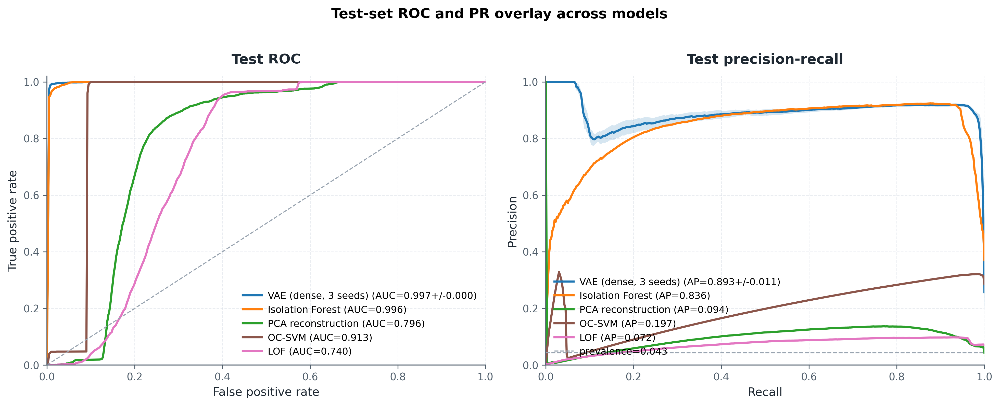
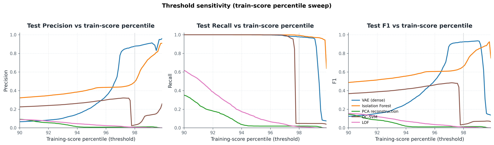
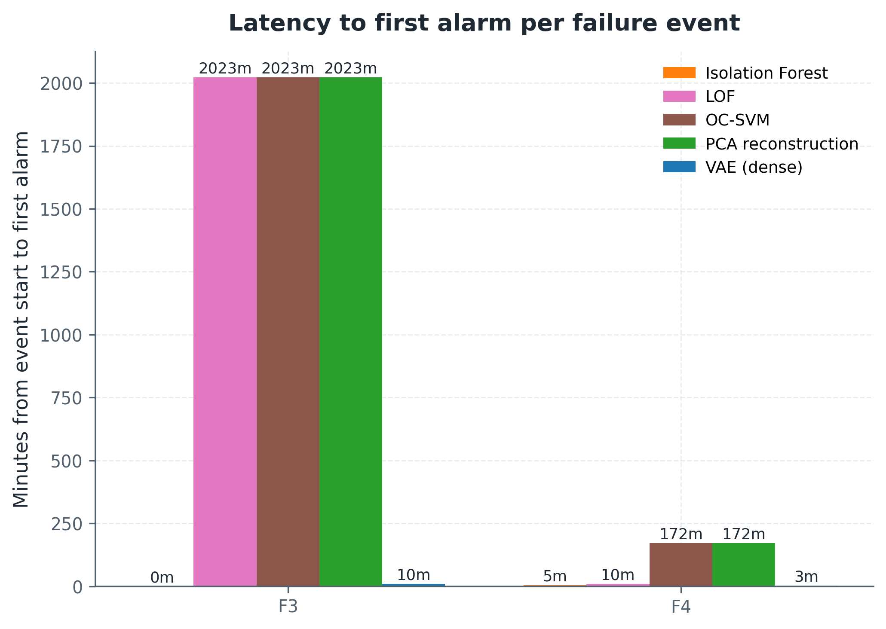
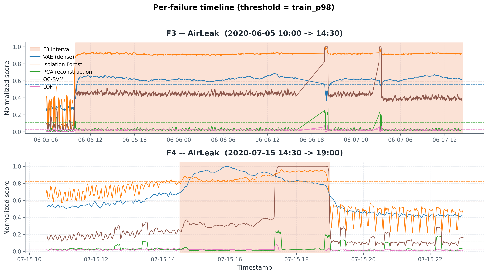

# MetroPT3 anomaly detection -- final report

This report consolidates the results of the multi-seed grid study on
MetroPT3 air-leak detection. All numbers come from one grid run plus
four classical baseline runs and are regenerable from the configs in
`configs/` (see `docs/reproducibility.md` for the exact pipeline).

## 1. Task

Unsupervised anomaly detection on one-minute air-compressor sensor
readings (15 channels). Models are fit on a chronological prefix that
contains only normal operation and have to flag windows that overlap the
four annotated air-leak intervals (F1-F4). Evaluation is on F3 + F4
(June and July 2020); F2 (May 2020) is used only for early-stopping
diagnostics. Failure labels are window-level, derived from row labels
with the "last 10 percent" rule.

| Split | Period | Rows | Windows (size 60, stride 10) | Positive windows |
|---|---|---:|---:|---:|
| Train      | 2020-02-01 to 2020-04-30 | 644,032 | 63,526 | 0 |
| Validation | 2020-05-01 to 2020-05-31 | 212,800 | 21,275 | 237 |
| Test       | 2020-06-01 to 2020-07-31 | 439,152 | 43,910 | 1,894 |

## 2. Headline result

Test set, threshold = `train_p98` (98th percentile of training scores;
fully unsupervised, deployable). Three random seeds (42, 7, 123) for
every dense VAE configuration.

| Model | F1 | Precision | Recall | ROC-AUC | PR-AUC |
|---|---:|---:|---:|---:|---:|
| **VAE (dense [128, 64], window=120)** | **0.931 +/- 0.006** | **0.890 +/- 0.012** | **0.977 +/- 0.001** | **0.997 +/- 0.000** | **0.893 +/- 0.013** |
| Isolation Forest                      | 0.661 | 0.496 | 0.994 | 0.996 | 0.836 |
| OC-SVM (Nystroem + SGD)               | 0.037 | 0.030 | 0.048 | 0.913 | 0.197 |
| PCA reconstruction                    | 0.013 | 0.010 | 0.019 | 0.796 | 0.094 |
| LOF (k=35)                            | 0.008 | 0.006 | 0.011 | 0.740 | 0.072 |

Source: [`tables/baselines/baseline_comparison_primary_train_p98.csv`](tables/baselines/baseline_comparison_primary_train_p98.csv).

The dense VAE on 120-step windows gives the highest F1 with the lowest
seed variance. Isolation Forest is second on F1, and matches the VAE on
ROC-AUC and PR-AUC; it just trades precision for recall, which means
roughly twice as many false positives as true positives. PCA, OC-SVM
and LOF have respectable ROC-AUC but their score distributions overlap
the normal training distribution to the point where `train_p98` rarely
fires on real anomalies.

The cross-model overlay tells the same story without committing to a
single threshold:

## 3. Architecture / window / depth ablation

Multi-seed grid (mean +/- std across seeds), test split, `train_p98`:

| Group         | Base experiment       | Window | Hidden       | Arch             | Seeds | F1                | ROC-AUC           | PR-AUC            |
|---|---|---:|---|---|---:|---:|---:|---:|
| windows       | **win120**            | 120    | `[128, 64]`     | dense            | 3 | **0.931 +/- 0.006** | **0.997 +/- 0.000** | **0.893 +/- 0.013** |
| architectures | arch_lstm             | 60     | `[128, 64]`     | lstm_autoencoder | 1 | 0.922 +/- 0.000   | 0.995 +/- 0.000   | 0.861 +/- 0.000   |
| layers        | layers_128_64_32      | 60     | `[128, 64, 32]` | dense            | 3 | 0.689 +/- 0.185   | 0.993 +/- 0.002   | 0.756 +/- 0.055   |
| layers        | layers_64_32          | 60     | `[64, 32]`      | dense            | 3 | 0.686 +/- 0.380   | 0.994 +/- 0.003   | 0.822 +/- 0.065   |
| layers        | layers_128_64         | 60     | `[128, 64]`     | dense            | 3 | 0.528 +/- 0.093   | 0.994 +/- 0.000   | 0.737 +/- 0.005   |
| layers        | layers_256_128_64     | 60     | `[256, 128, 64]`| dense            | 3 | 0.368 +/- 0.251   | 0.994 +/- 0.001   | 0.742 +/- 0.031   |
| layers        | layers_256_128        | 60     | `[256, 128]`    | dense            | 3 | 0.352 +/- 0.306   | 0.994 +/- 0.001   | 0.755 +/- 0.027   |
| windows       | win60                 | 60     | `[128, 64]`     | dense            | 3 | 0.312 +/- 0.267   | 0.993 +/- 0.001   | 0.717 +/- 0.054   |
| architectures | arch_conv1d           | 60     | `[128, 64]`     | conv1d           | 2 | 0.248 +/- 0.013   | 0.996 +/- 0.001   | 0.805 +/- 0.048   |
| windows       | win30                 | 30     | `[128, 64]`     | dense            | 3 | 0.190 +/- 0.062   | 0.972 +/- 0.029   | 0.512 +/- 0.218   |

Sources: [`tables/grid_aggregated.csv`](tables/grid_aggregated.csv) and
[`grid_summary.md`](grid_summary.md).

A few things stand out. Window size matters more than architecture
choice: dense VAE on `window_size=120` is essentially perfect on the
two test events, while the same architecture at `window_size=30` barely
beats the no-info baseline. Longer context shrinks the chance of any
single normal window resembling an early-failure window, which sharpens
the score distribution. The dense window-60 configurations all show
high seed variance on F1 (std up to 0.38) because the model's
reconstruction error is fairly high on normals too, so a small shift
in the score distribution moves a lot of windows across the `train_p98`
threshold; PR-AUC, which integrates over thresholds, is much more
stable for those same configurations (always >= 0.717). The LSTM
autoencoder matches dense window-120 on F1 (0.922 vs 0.931) but has
been multi-seeded only once and is roughly 6x slower, which is why
dense window-120 is quoted as the headline.

Per-group bar charts are saved at [`figures/window_comparison_*`](figures),
[`figures/layer_comparison_*`](figures) and
[`figures/architecture_comparison_*`](figures).

## 4. Threshold sensitivity

The `train_pXX` threshold is the operating knob in deployment. We sweep
`XX` from 90 to 99.9 on every model and re-evaluate test F1 / precision
/ recall:

Source: [`tables/threshold_sensitivity.csv`](tables/threshold_sensitivity.csv).

The VAE keeps F1 above 0.9 across roughly the entire `[97, 99.5]` band,
so the `train_p98` headline is not a special operating point. Isolation
Forest peaks at slightly higher percentiles (its score distribution has
a longer normal tail). The other three baselines never reach
competitive F1 under any unsupervised threshold.

## 5. Per-failure timeline and latency to first alarm

For each test event we measure latency from event start to the first
alarm fired inside the event, and local precision / recall in a
+/- 240 minute window around the event.

| Model                | Event | TP   | FN   | FP near event | Recall (in event) | Precision (near event) | Latency (min) |
|---|---|---:|---:|---:|---:|---:|---:|
| VAE (dense, win=120) | F3    |  846 |   20 |   0           | 0.977             | 1.000                  | 10.1          |
| VAE (dense, win=120) | F4    |   81 |    0 |  43           | 1.000             | 0.653                  |  3.0          |
| Isolation Forest     | F3    | 1732 |    0 |   2           | 1.000             | 0.999                  |  0.2          |
| Isolation Forest     | F4    |  150 |   12 |  10           | 0.926             | 0.938                  |  4.6          |
| PCA reconstruction   | F3    |   24 | 1708 |   8           | 0.014             | 0.750                  | miss          |
| PCA reconstruction   | F4    |   12 |  150 |  16           | 0.074             | 0.429                  | 171           |
| OC-SVM               | F3    |   32 | 1700 |   0           | 0.018             | 1.000                  | miss          |
| OC-SVM               | F4    |   58 |  104 |   0           | 0.358             | 1.000                  | 171           |
| LOF                  | F3    |   14 | 1718 |   3           | 0.008             | 0.824                  | miss          |
| LOF                  | F4    |    7 |  155 |  22           | 0.043             | 0.241                  |  9.6          |

`miss` = no alarm fired inside the event interval.
Source: [`tables/failure_event_metrics.csv`](tables/failure_event_metrics.csv).

Both the VAE and Isolation Forest detect F3 within ten minutes and F4
within five minutes. The visible difference is precision around the
event: IF flags many extra normal windows in the surrounding hours
(its overall test precision is 0.50 vs the VAE's 0.89), so a
maintenance team using IF would receive about twice as many alarms
that turn out to be fine.

## 6. Latent-space sanity check

PCA and t-SNE projections of `z_mean` for the headline VAE on the test
split, anomalies coloured by reconstruction score:

- [`figures/vae_latent_space_20260430_081342_test_pca.png`](figures/vae_latent_space_20260430_081342_test_pca.png)
- [`figures/vae_latent_space_20260430_081342_test_tsne.png`](figures/vae_latent_space_20260430_081342_test_tsne.png)

Anomalous windows form a separable cluster in both projections, with
the highest-score points at the cluster periphery. This is consistent
with the high test ROC-AUC.

## 7. VAE collapse and the collapse guard

A practical pathology worth documenting: without the guard described in
[`../docs/methodology.md`](../docs/methodology.md), the dense VAE on
this data hits a state where it reconstructs anomalies *better* than
normals, and the score direction silently flips. We saw this by running
30 epochs with a `val_roc_auc` callback: the metric peaks above 0.99
between epochs 5-15 and then degrades to ~0.08 by epoch 25. The guard
tracks the best `val_roc_auc` seen during training and restores those
weights if the AUC drops below 0.5 after having peaked above 0.7. The
headline grid was trained with this guard always on; without it, the
0.931 F1 is not reproducible.

## 8. Reproducibility

The end-to-end pipeline (preprocessing -> windowing -> grid -> baselines
-> figures) takes about 50 minutes on a single H100 from a fresh
checkout. See [`../docs/reproducibility.md`](../docs/reproducibility.md)
for the exact commands and the network workaround used to download the
raw CSV from UCI.

Determinism is partial on purpose. All Python / NumPy / TensorFlow
random sources are seeded, but TF op-determinism is opt-in (set
`VAE_DETERMINISM=1`) because deterministic cuDNN kernels interact with
weight init in a way that triggers the collapse described above.

Threshold policy: `train_p98` is the deployable, unsupervised threshold
and is the only headline number. `val_f1` looks at validation labels
and is reported only as a diagnostic upper bound.

## 9. Limitations

- The held-out test set has only two failure events (F3, F4). More
  events would give tighter per-event metrics; this is why we also
  report the test-set aggregates where every window contributes.
- F1 is window-level, not event-level or row-level. An end-to-end study
  would compare alarm-debounced detectors and report alarm-level
  precision / recall.
- The LSTM autoencoder is run with one seed for compute reasons; a
  multi-seed sweep would say whether its 0.922 F1 is an unusual draw.
- We do not study label-noise robustness; the failure intervals are
  treated as ground truth.

The earlier README result tables (single-seed VAE on `window_size=60`,
F1 ~ 0.88) are superseded by the multi-seed grid above and should not
be quoted any more.
